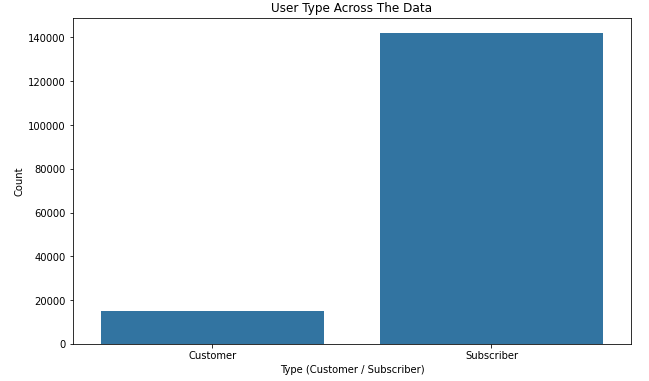
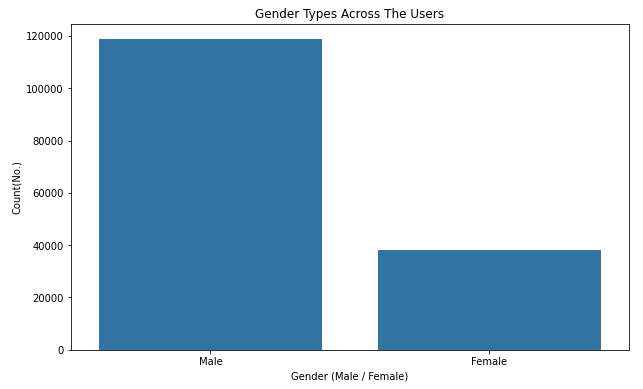

# Comunicate Data Findings<!-- omit in toc -->
### Ford GoBike System Data Analysis<!-- omit in toc -->

# Table of Content<!-- omit in toc -->
- [Introduction](#introduction)
- [Prerequisites](#prerequisites)
    - [Languages and libraries used](#languages-and-libraries-used)
- [Findings](#findings)
- [Summary](#summary)
- [Conclusions](#conclusions)
    - [Key Insight](#key-insight)
- [Authors](#authors)

# Introduction

In this project, I analyzed the Ford GoBike System dataset from Kaggle and communicated the findings using visualizations. I made use of the Python libraries NumPy, pandas, and Matplotlib in this analysis. I went through a full EDA process while analyzing this dataset including the process of wrangling, cleaning, and analyzing its data.

# Prerequisites
The used dataset can be found [here](https://www.kaggle.com/code/chirag02/ford-gobike-data-analysis)
### Languages and libraries used
- Python 3.9
- Pandas
- NumPy
- Matplotlib 
- Seaborn

# Findings

CLICK HERE TO VIEW FINDINGS AND VISUALIZATIONS

    
- #### About a 90% of the users are subscribed to the service and others are just customers

---
---

- #### Most of users tend to be Males be 76%

---
---

- #### Most of the bikes usage are in the work days ~(83%), with high usage on Tuesday; assuming it's used to commute to work    

---
---

- #### Most of the bikes usage are in the work days ~(83%), with high usage on Tuesday; assuming it's used to commute to work

---
---

- #### Most of the trips duration are 5 to 10 hours long.

    
---

---

# Summary
In the exploration, I found that: 
- Around 90% of users are subscribers
- Around of 75% of users are males
- Around 83% of trips are made on the weekdays and in the weekends
- Thursday has the most trips done
- Trip hourly duration distribution is skewed to the right with most of the trips are within the range of 5 to 10 hours long
- Trip count and duration decreases as the member age goes up
- Most of customers and subscribers that are taking the trips are within the ages of 27 to 37
- Females trips duration are slightly longer than males
- Customers over all take longer trips than subscribers
- Most of users are males but females take the longer trips but also, customers take longer trips over all than subscribers so i'm assuming most of customers are females.

# Conclusions
### Key Insight

> Workdays and trips duration , also trip time users seems to make trips around 7 to 9 am and also around 6 to 8 pm, which strengthes the assumption that users are using the service to commute to and from work.

---

# Authors
- [@Hossam El-Shabory](https://github.com/hossam-elshabory)
