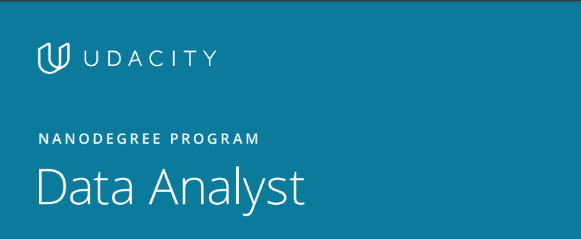

# Udacity Data Analyst Nanodegree FWD<!-- omit in toc -->

# Table Of Content<!-- omit in toc -->
- [Overview Of Certificate](#overview-of-certificate)
- [Certificate Content](#certificate-content)
- [Certificate Projects](#certificate-projects)
- [Skills Learned](#skills-learned)

# Overview Of Certificate
This program prepares you for a career as a data analyst by helping you learn to organize data, uncover
patterns and insights, draw meaningful conclusions, and clearly communicate critical findings. You’ll
develop proficiency in Python and its data analysis libraries (Numpy, pandas, Matplotlib) and as you
build a portfolio of projects to showcase in your job search.

This Certificate was part of the EgyptFWD initiative.

  

# Certificate Content
The Certificate consists of two main courses :
1. ### [Professional Data Analysis Nanodegree Program](https://github.com/hossam-elshabory/Udacity_Data_Analyst_Nanodegree_FWD/tree/master/Udacity_Professional_Data_Analyst_Nanodegree_FWD)

    

    
CLICK HERE TO VIEW CERTIFICATE

    

    

2. ### [Advanced Data Analysis Nanodegree Program](https://github.com/hossam-elshabory/Udacity_Data_Analyst_Nanodegree_FWD/tree/master/Udacity_Advanced_Data_Analyst_Nanodegree_FWD)

    

    
CLICK HERE TO VIEW CERTIFICATE

    

    

# Certificate Projects
- ### [Professional Data Analysis Nanodegree Program](Udacity_Professional_Data_Analyst_Nanodegree_FWD\README.md)
  1. [Explore_US_Bikeshare_Data](Udacity_Professional_Data_Analyst_Nanodegree_FWD\Explore_US_Bikeshare_Data\README.md)
  2. [Investigate_TMDb_Movie_Dataset](Udacity_Professional_Data_Analyst_Nanodegree_FWD\Investigate_TMDb_Movie_Dataset\README.md)

- ### [Advanced Data Analysis Nanodegree Program](Udacity_Advanced_Data_Analyst_Nanodegree_FWD\README.md)
  1. [Analyze_AB_Test_Results](Udacity_Advanced_Data_Analyst_Nanodegree_FWD\Analyze_AB_Test_Results\README.md)
  2. [Communicate_Data_Findings](Udacity_Advanced_Data_Analyst_Nanodegree_FWD\Communicate_Data_Findings\README.md)

# Skills Learned

